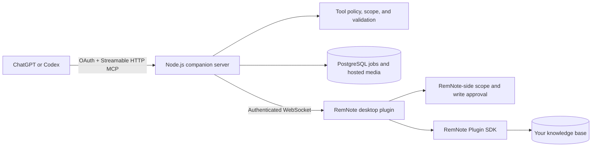

# RemNote MCP

I did not want another AI note generator. I wanted ChatGPT and Codex to work
with the knowledge base I already have in RemNote, while I stay in control of
what they can read and change.

RemNote MCP is the bridge I built for that job. It gives an MCP client bounded
tools for reading, searching, writing, formatting, importing, creating cards,
inserting media, and checking the result inside RemNote. The important part is
not only that a tool returns success: write workflows use scope checks,
idempotency, typed failures, and RemNote readback so the client can tell what
actually happened.

## What it can do

- Read the focused Rem, children, trees, breadcrumbs, selections, rich text,
  and approved workspace search results.
- Create and update structured Rem trees without flattening everything into a
  page of text.
- Preserve formulas, headings, highlights, Concepts, Descriptors, and several
  card types.
- Plan and resume large Markdown imports with checkpoints and source-fidelity
  verification.
- Insert URL-backed images, audio, YouTube videos, and direct videos as native
  RemNote media.
- Accept ChatGPT-uploaded raster images, MP3 audio, and real MP4 video through
  a secure hosted-media pipeline.
- Expose small tool profiles so a normal writing task does not need the entire
  developer surface.
- Report connection, scope, permission, timing, and readback evidence in a
  standard result envelope.

The generated [tool reference](TOOL_REFERENCE.md) is the exact registry guide.
It currently records 82 declared tools, 79 public developer-profile tools, and
25 tools in the default `mass_note_writer` profile.

## How it works



The server handles MCP discovery, authentication, policy, durable jobs, media
hosting, and request routing. The desktop plugin checks the RemNote permission
boundary again and performs the SDK operation. The knowledge base is not copied
into the companion database.

ChatGPT and Codex use the same installed app authentication, with no extra
client-specific credential. RemNote scope and write approval still apply to
every client.

## Install the plugin from localhost

Requirements:

- RemNote desktop
- Node.js 20 or newer
- npm
- Git

Clone the repository and install its dependencies:

```bash
git clone https://github.com/HTGit63/remnote-plugin-template-react.git
cd remnote-plugin-template-react
npm ci
npm ci --prefix server
npm run dev:start
npm run dev:status
npm run dev:doctor
```

Then open **RemNote desktop → Settings → Plugins → Develop from localhost** and
enter exactly:

```text
http://localhost:8080
```

Do not append `/manifest.json`. Leave the local development service running
while RemNote is using the plugin. Stop it later with:

```bash
npm run dev:stop
```

This loads the current branch directly and avoids waiting for RemNote's plugin
review process. Port `8080` serves only the plugin JavaScript and manifest. It
is not the MCP server and does not need an ngrok tunnel.

## Connect ChatGPT or Codex

New plugin installations use the hosted Render bridge by default. The endpoint
shown in the RemNote MCP sidebar should be:

```text
wss://remnote-plugin-template-react.onrender.com/remnote
```

In ChatGPT Developer Mode, create or refresh the private MCP app with:

```text
https://remnote-plugin-template-react.onrender.com/mcp
```

Complete pairing in the plugin, choose the smallest useful scope and tool
profile, and keep **Ask for every write** enabled for the first run.

| Address | Used by | Purpose |
| --- | --- | --- |
| `http://localhost:8080` | RemNote desktop | Loads the development plugin bundle |
| `wss://remnote-plugin-template-react.onrender.com/remnote` | RemNote plugin | Connects the plugin to the hosted bridge |
| `https://remnote-plugin-template-react.onrender.com/mcp` | ChatGPT or Codex | Connects the MCP app |

An existing installation may keep its previously saved localhost override. If
the sidebar copies `http://localhost:47392/mcp`, open the plugin settings and
replace the bridge URL with the hosted `wss://.../remnote` address above. The
plugin then derives the correct hosted `/mcp` URL. Custom local and self-hosted
URLs remain supported and are never overwritten.

ChatGPT caches an app's tool list per conversation. After a deployment or tool
profile change, rebuild/restart the server if local, refresh the app in
**Settings → Plugins**, and start a new conversation. If the server reports 79
tools but the current chat reports 77, the chat is using an older discovery
snapshot; changing the server code again will not refresh that conversation.

## Run the entire bridge locally with ngrok

This advanced path is only for developing the companion server itself. ChatGPT
cannot connect to `http://localhost:47392/mcp`, so expose that port through a
temporary public HTTPS tunnel. Keep authentication enabled; never tunnel
`REMNOTE_BRIDGE_ALLOW_NO_TOKEN=1` to the internet.

1. Install ngrok, start `ngrok http 47392`, and copy its HTTPS origin, for
   example `https://example.ngrok.app`.
2. Copy `.env.example` to `.env`. Replace every example public origin with the
   ngrok HTTPS origin, configure PostgreSQL, and generate new session/admin
   secrets.
3. The server does not auto-load `.env`. Load it into the shell, then start the
   companion server:

```bash
set -a
source .env
set +a
npm run server:dev
```

4. Set the RemNote plugin bridge URL to
   `wss://example.ngrok.app/remnote`.
5. Add or refresh the ChatGPT Developer Mode app with
   `https://example.ngrok.app/mcp`.
6. Complete pairing, then start a new conversation so ChatGPT receives the
   current tool descriptors.

Free ngrok URLs can change after restart. When the origin changes, update
`.env`, restart the server, update the plugin bridge URL, and refresh the
ChatGPT app. For local-only CLI tests that do not use ChatGPT, use
`.env.local.example`; it keeps the bridge on loopback with a local token.

## A safe first test

Create and focus a disposable Rem called `Plugin Test`, then ask:

```text
Use RemNote MCP. Check bridge status, read the focused Rem, and return at most
20 direct children in RemNote order. Do not call any write tool.
```

For a write test, approve only the disposable Rem, use one stable idempotency
key, request readback verification, and reuse the same key if a response is
uncertain.

## Uploaded image, MP3, and MP4 files

The current developer and default writing profiles register:

- `insert_image_from_file` for PNG, JPEG, WebP, and GIF
- `insert_audio_from_file` for MP3
- `insert_video_from_file` for real MP4 containers

Each file tool receives ChatGPT's authorized file object, downloads it through
an SSRF-resistant HTTPS client, validates the bytes rather than trusting the
extension, stores the verified asset in PostgreSQL, gives RemNote an opaque
HTTPS URL, creates native media rich text, and verifies the resulting Rem.

The tested `NEW LINEN 新しいリネン.mp3` is a valid 2,970,931-byte MPEG Layer
III file and is below the 25 MiB audio limit. The current server exposes its
file tool correctly. A chat that still shows only `insert_audio_from_url` must
refresh the app and start a new conversation. Diagnostics report MCP exposure
separately from runtime verification: `callable` means registered and listed,
while `runtimeVerified` requires a successful server or connected-plugin run.

A filename ending in `.mp4` is not enough. One reported test file was actually
a Matroska/WebM container with VP8 video, so it is correctly rejected by the
MP4-only loader. Use a real MP4 file. SVG is also intentionally rejected; turn
trusted SVG artwork into PNG first.

Successful hosted files are retained because the RemNote media object still
points to the bridge URL. Deleting the bytes immediately after readback would
make the image, audio, or video fail later or on another device. A newly
created orphan is deleted only after a definitive no-write failure. Unknown
write outcomes and successful references are retained.

## Tool profiles

| Profile | Public tools | Good for |
| --- | ---: | --- |
| `basic` | 8 | Connection checks and bounded reads |
| `mass_note_writer` | 25 | Normal structured notes, imports, and uploaded media |
| `note_writer` | 57 | Wider note, card, design, and URL-media workflows |
| `power_user` | 74 | Advanced formatting and repair |
| `developer` | 79 | Diagnostics and the complete safe public surface |
| `danger` | 79 by default | Developer surface while delete remains server-gated |

`replace_rem` stays hidden, `create_folder` stays unsupported, and real delete
requires an explicit server flag plus dry-run and approval guards. Media does
not require the danger profile.

## Security and permissions

- Hosted file ingestion requires authenticated OAuth and an allowed write
  scope.
- Remote downloads require HTTPS, pin a validated public DNS address, re-check
  redirects, and block loopback, private, link-local, mapped, NAT64, and other
  special-use networks.
- File signatures, byte limits, timeouts, safe names, and verified response
  content types are enforced.
- Hosted assets use random UUID paths, owner-scoped idempotency, parameterized
  SQL, range requests for playback, `nosniff`, and a restrictive CSP.
- Temporary ChatGPT download URLs and credentials are not forwarded to RemNote
  or returned in normal tool output.
- The hosted asset URL is intentionally public because RemNote must fetch it.
  Do not use this path for confidential media.
- The current personal deployment has file-size limits but no aggregate
  per-owner quota. Database usage must be monitored before multi-tenant use.

Never put OAuth secrets, pairing codes, database URLs, bridge tokens, or
private note content into committed files or benchmark reports.

## Known boundaries

- RemNote desktop must be open and the plugin connected for SDK operations.
- The app is a private Developer Mode integration, not a public ChatGPT App
  Store listing.
- PostgreSQL is required for restart-safe imports and hosted file media.
- Native readback proves the stored RemNote structure, not visible rendering or
  audible playback. A person must still perform that final UI check.
- Existing public media URLs can fail later if their host removes the asset.
- Hosted media has no end-user deletion/expiry screen yet.
- Some RemNote SDK behavior depends on the installed desktop version; unsupported
  paths return typed errors instead of pretending to succeed.

## Troubleshooting

- **Local plugin will not load:** run `npm run dev:status` and
  `npm run dev:doctor`; use exactly `http://localhost:8080`.
- **`PLUGIN_NOT_CONNECTED`:** keep RemNote open, enable the local plugin, and
  verify the sidebar WebSocket endpoint.
- **`PLUGIN_NOT_PAIRED`:** finish the pairing flow and approve the requested
  RemNote scope.
- **MP3/MP4 file tools are missing:** select `mass_note_writer` or `developer`,
  refresh the ChatGPT app, and open a new conversation.
- **Tool is listed but not runtime-verified:** this does not mean the action is
  missing. Connect RemNote and run it against a disposable Rem for live proof.
- **`REMOTE_HOST_BLOCKED`:** the download resolved only to a non-public or
  otherwise unsafe address. Do not bypass the protection.
- **`HOSTED_MEDIA_UNSUPPORTED_FORMAT`:** the bytes are not a supported format,
  even if the filename extension looks correct.
- **An uncertain write timed out:** keep the same idempotency key, inspect
  readback, and follow the returned reconciliation guidance.

## Development checks

```bash
npm test
npm run check-types
npm run validate
npm run build
npm run server:build
npm run server:smoke
```

Additional architecture and testing details are in
[docs/engineering-guide.md](docs/engineering-guide.md) and
[docs/remnote-mcp-repair-and-testing.md](docs/remnote-mcp-repair-and-testing.md).
