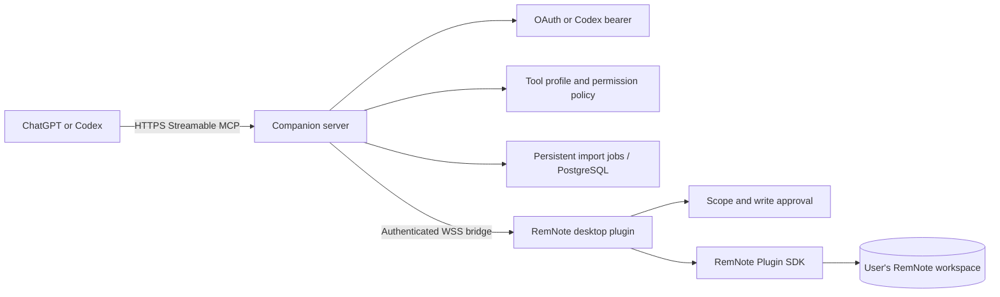

# RemNote MCP

RemNote MCP is a secure Model Context Protocol bridge that lets ChatGPT and
Codex read, create, verify, format, and resume structured work inside RemNote.
The RemNote plugin keeps workspace access in RemNote; the hosted companion
server supplies MCP discovery, authentication, policy, job persistence, and
routing.

This is not a general-purpose workspace connector. RemNote content is an
ordered graph of Rems with Concepts, Descriptors, cards, formulas, rich text,
styles, and document/folder boundaries. Correctness therefore means preserving
hierarchy and learning semantics, preventing duplicate replay, and reading the
written graph back—not merely storing a block of text.

## Architecture



The remote server does not contain a copy of the knowledge base. A connected
RemNote desktop plugin performs SDK operations after server and plugin policy
checks.

## Supported platforms

- RemNote desktop with Plugin SDK `0.0.46`. The manifest deliberately sets
  `enableOnMobile: false`.
- ChatGPT Developer Mode using the hosted Streamable HTTP endpoint.
- Codex desktop, CLI, or IDE clients that support remote Streamable HTTP MCP.
- Node.js 20 or newer for the companion server and local development.

The public ChatGPT App review process is not complete. Use a private Developer
Mode app or Codex connection for evaluation.

## Release identity

| Item | Value |
| --- | --- |
| Product | RemNote MCP |
| Plugin release | `0.1.0` |
| Release tag | `v0.1.0` |
| Proven runtime source/deployment | `ebc99df6901356b055a425b5909e8d0b5829d5cf` |
| Hosted MCP endpoint | `https://remnote-plugin-template-react.onrender.com/mcp` |
| Plugin archive | [PluginZip.zip](https://github.com/HTGit63/remnote-plugin-template-react/releases/download/v0.1.0/PluginZip.zip) |
| Archive SHA-256 | `bc43addc88e6c32c01ea1cf9e4a5c080ff29eefbcd4f189121363454f49474c2` |

The plugin/product version is `0.1.0`. The root and server npm packages remain
at the intentional internal implementation version `0.0.1`; they are not the
judge-facing plugin release lane. The final tag contains release documentation
and packaging only after the proven runtime commit; no production source was
changed during Stage 7.

## Judge quick start

1. Download `PluginZip.zip` from the release link above.
2. In RemNote desktop, open **Settings → Plugins**, choose **Upload plugin**,
   select the ZIP, enable **RemNote MCP**, and open its sidebar panel.
3. For the hosted service, set the plugin server URL to
   `wss://remnote-plugin-template-react.onrender.com/remnote`.
4. Choose the smallest useful scope, normally **Current Rem tree**, and
   **Ask for every write** for the first test.
5. Connect ChatGPT or Codex using the instructions below. Complete the displayed
   pairing code in the RemNote plugin.
6. Run the bounded read-only test before any write. Use a disposable Rem for all
   write, import, and media demonstrations.

No prompt should contain a bridge token, Codex bearer, OAuth token, pairing
secret, or database credential.

## ChatGPT connection and pairing

1. Enable ChatGPT Developer Mode.
2. Create a private app with MCP URL
   `https://remnote-plugin-template-react.onrender.com/mcp`.
3. Complete OAuth, open the returned pairing flow, and approve the displayed
   code in the RemNote plugin.
4. Select the `mass_note_writer` profile for the normal judge workflow. Refresh
   or recreate the private app after tool-metadata changes.

The MCP server exposes accurate read-only/destructive/idempotent/open-world
annotations. Handlers are retry-safe because ChatGPT may retry calls. See the
official OpenAI guides for [building an MCP server](https://developers.openai.com/apps-sdk/build/mcp-server),
[deploying an app](https://developers.openai.com/apps-sdk/deploy), and
[submission requirements](https://developers.openai.com/apps-sdk/deploy/submission).

## Codex connection and pairing

Put the following in Codex `config.toml`:

```toml
[mcp_servers.remnote_mcp]
url = "https://remnote-plugin-template-react.onrender.com/mcp"
bearer_token_env_var = "REMNOTE_CODEX_TOKEN"
default_tools_approval_mode = "writes"
```

Set `REMNOTE_CODEX_TOKEN` in the process environment, not in the TOML file.
The bearer authenticates the Codex client; it does not grant a RemNote scope or
trusted-write authority. Complete the separate `/codex/pair/*` link in the
plugin before writing. Official reference:
[Codex Streamable HTTP MCP servers](https://learn.chatgpt.com/docs/extend/mcp#streamable-http-servers).

## Local development

Install dependencies and start the companion server:

```bash
npm ci
npm ci --prefix server
cp .env.local.example .env
```

Replace the example bridge token, keep `REMNOTE_BRIDGE_ALLOW_NO_TOKEN=0`, use
the `mass_note_writer` profile, and keep deletion disabled for normal work. Then:

```bash
set -a
source .env
set +a
npm run server:dev
```

In another terminal, serve the plugin:

```bash
npm run dev:start
npm run dev:status
npm run dev:doctor
```

In RemNote choose **Develop from localhost** and enter exactly
`http://localhost:8080`—do not append `/manifest.json`. With the sample
single-port configuration, set the plugin bridge URL to
`ws://127.0.0.1:47392/remnote-bridge`, and use the same bridge token as the
server. Keep the development server running while the plugin is installed.

Stop it with `npm run dev:stop`.

## Hosted deployment

`render.yaml` defines the Node service. A hosted deployment requires HTTPS,
PostgreSQL, and distinct high-entropy secrets for `SESSION_SECRET`,
`ADMIN_DEBUG_SECRET`, and `REMNOTE_CODEX_TOKEN`. Set `PUBLIC_BASE_URL`,
`MCP_SERVER_URL`, `OAUTH_ISSUER`, and `DATABASE_URL`; keep
`REMNOTE_BRIDGE_ALLOW_NO_TOKEN=0` and `REMNOTE_BRIDGE_ENABLE_DELETE_TOOL=0`.

Use `wss://<host>/remnote` for the plugin and `https://<host>/mcp` for MCP.
Restrict allowed origins to ChatGPT, RemNote, and the deployment origin. Run
the full auth, pairing, routing, boundary, idempotency, and persistence gates
before exposing a new deployment.

## Scope, writes, and tool profiles

Two independent controls apply: a scope limits *where* tools may operate, and
a write mode controls *when* mutation is allowed.

- `focused_rem_only`: bounded focus reads.
- `current_rem_tree`: the approved current tree; recommended for judge writes.
- `workspace_allowed`: broader workspace access; use only when the task needs it.
- Ask for every write: safest first-run mode.
- Trusted inside scope: removes repeated approval only inside the approved root.
- Delete remains absent unless the server explicitly enables it and the
  connection has the `danger` profile. Judge instructions never use `danger`.

| Profile | Public tools | Intended use |
| --- | ---: | --- |
| `basic` | 8 | Status and bounded reads |
| `mass_note_writer` | 20 | Recommended judge note/import workflow |
| `note_writer` | 54 | Additional note and media operations |
| `power_user` | 71 | Advanced formatting and repair |
| `developer` | 76 | Diagnostics and the Stage 6 media demo |
| `danger` | 76 by default | Same as developer while delete exposure is disabled |

The delete tool would make `danger` 77 only after an explicit server-side
enable. The hosted default remains `mass_note_writer`; select `developer` only
for the media demonstration and return to the smaller profile afterward.

## Judge prompts

### 1. Read-only test

```text
Use RemNote MCP. Check bridge and plugin status, read the focused Rem, and read
at most 25 direct children in exact RemNote order. Report each Rem ID and label.
Do not call any write tool and do not mutate anything.
```

Expected: focus and ordered children are returned with `created`, `updated`, and
`deleted` counts all zero.

### 2. Safe-write test

Create a disposable parent Rem first, approve only its tree, then prompt:

```text
Under the approved disposable parent, use create_or_replace_note_from_markdown
to create "Judge Safe Write v0.1.0" with one child containing the formula
$E=mc^2$ and one Descriptor card written as:
Energy-mass relation::Energy equals mass times the speed of light squared.
Use idempotency key judge-v010-safe-write-01 and verify after writing. Read back
the hierarchy, exact rich text, formula, and card. Repeat the same request with
the same key and prove that no duplicate Rem was created.
```

Expected: one hierarchy, formula, and card; successful readback; the same-key
repeat reports already applied or returns the same stable IDs.

### 3. Resumable-import test

Prepare a disposable four-section Markdown fixture, then prompt:

```text
Plan a resumable import of this four-section Markdown under the approved test
parent. Start the job with idempotency key judge-v010-resume-01. Run exactly one
job step, report the persistent checkpoint and stop. Then resume only pending
chunks until complete, verify whole-source fidelity, and call resume once more
to prove that completed chunks are not replayed. Never delete existing Rems.
```

Expected: `plan_note_import`, `start_note_import_job`, one
`run_note_import_job_step`, `resume_note_import_job`, and
`verify_note_import_job` show bounded progress, persistence durability, exact
readback, and zero completed-job replay.

### 4. Media test

Select `developer`, refresh the client tool snapshot, approve a disposable
parent, then prompt:

```text
Under this approved disposable parent, insert exactly one image, one audio
player, and one YouTube embed with verify-after-write enabled and stable keys:
image https://interactive-examples.mdn.mozilla.net/media/cc0-images/grapefruit-slice-332-332.jpg
audio https://interactive-examples.mdn.mozilla.net/media/cc0-audio/t-rex-roar.mp3
video https://www.youtube.com/watch?v=jNQXAC9IVRw
Read back the native rich-text payloads. Repeat each same-key operation and
prove that all three Rem IDs remain stable with no duplicate.
```

Optionally test direct MP4 playback with
`https://interactive-examples.mdn.mozilla.net/media/cc0-videos/flower.mp4`.
Stored rich-text readback proves structure; a human must still confirm render,
audio playback, YouTube embed/playback, and direct-video playback in RemNote.

## Build Week provenance

The pre-existing foundation included the RemNote plugin shell, companion bridge,
basic graph reads/writes, Markdown/rich-text support, cards/formulas/styles,
bulk-import concepts, authentication/pairing, and automated tests.

The audited release delta from historical baseline `5380dd5` through `v0.1.0`
stabilized reconnect and routing, authorization boundaries, exact readback,
idempotent replay, resumable persistent imports, UI recovery, tool metadata,
image/audio/video URL insertion, discovery-cache recovery, exact live proof,
and judge-ready release engineering. Inspect the
[historical comparison](https://github.com/HTGit63/remnote-plugin-template-react/compare/5380dd5f2b87fa7d908a346fef81862498d47eea...v0.1.0).
This range documents provenance; it is not a substitute for the event's own
eligibility rules.

Codex was used to audit the repository contract, implement and run TDD repairs,
inspect security boundaries, operate deployment checks, exercise the connected
RemNote MCP, and prepare release evidence. The repository does not independently
attest the exact hosted model subversion, so it does not make an unsupported
GPT-5.6 claim. Submission text should name GPT-5.6 only when the relevant Codex
session metadata confirms it.

## Security guidance

- Never commit `.env`, bearer tokens, OAuth credentials, pairing codes, session
  secrets, database URLs, or audit-log secrets.
- Keep no-auth mode off, use TLS remotely, restrict origins, rotate secrets,
  and use separate credentials for plugin, Codex, OAuth, and administration.
- Begin with the smallest profile and scope. Inspect every write preview; use a
  disposable tree for judging; keep deletion disabled.
- Media tools store caller-supplied stable HTTP(S) URLs. They do not download,
  proxy, generate, upload, or retain media on the server.
- Pairing and bearer authentication never bypass RemNote-side scope and write
  approval. Audit logs redact secrets.
- Treat tool descriptions and remote content as untrusted input. The server
  validates schemas, URL policy, body size, rate limits, and write boundaries.

Production dependency audits for this release reported zero known runtime
vulnerabilities in both root and server dependency trees.

## Known limitations

- RemNote desktop must be open and the plugin must remain connected for SDK
  reads and writes. Mobile plugin execution is disabled.
- This is a private Developer Mode/Codex release, not an approved public
  ChatGPT App Store listing.
- The default 20-tool profile intentionally omits media. Media requires the
  76-tool `developer` profile; a cached ChatGPT/Codex tool snapshot may require
  an app refresh or rescan after the profile changes.
- Media v0.1.0 accepts stable public HTTP(S) URLs only. It does not generate or
  host files. Stored payload verification and visual/playback verification are
  distinct evidence layers.
- Persistent resumable imports require PostgreSQL. Memory-only local jobs do
  not survive a server restart.
- The clean local development install and connected hosted runtime were proven;
  the rebuilt release ZIP still requires a final user upload in RemNote before
  that exact archive can be called clean-install confirmed.

## Troubleshooting

- **Plugin is missing after “Develop from localhost”:** run `npm run dev:start`,
  then `npm run dev:status` and `npm run dev:doctor`. Install the exact base URL
  `http://localhost:8080` and leave the server running.
- **`ERR_CONNECTION_REFUSED` at port 8080:** the plugin development server has
  stopped; restart it. This error does not by itself mean the bundle is broken.
- **`PLUGIN_NOT_CONNECTED`:** open RemNote, enable the plugin, verify the WSS/WS
  URL and token, then inspect the Connection card and hosted `/health` route.
- **`PLUGIN_NOT_PAIRED` or trusted-write failure:** complete the current pairing
  code and approve the needed scope/write mode in RemNote.
- **Media tools are missing:** select `developer`, refresh/rescan the client app,
  then run bridge health. Never enable `danger` merely to expose media.
- **Import cannot survive restart:** verify `storageDurability` is persistent and
  configure `DATABASE_URL`; do not describe `memory_only` as durable.
- **Write result is uncertain:** do not blindly retry with a new key. Reuse the
  original idempotency key, read back, and follow reconciliation instructions.

For exact tool schemas, permissions, timeouts, and idempotency behavior, see
[TOOL_REFERENCE.md](TOOL_REFERENCE.md). Engineering and deployment detail is in
[docs/engineering-guide.md](docs/engineering-guide.md).
