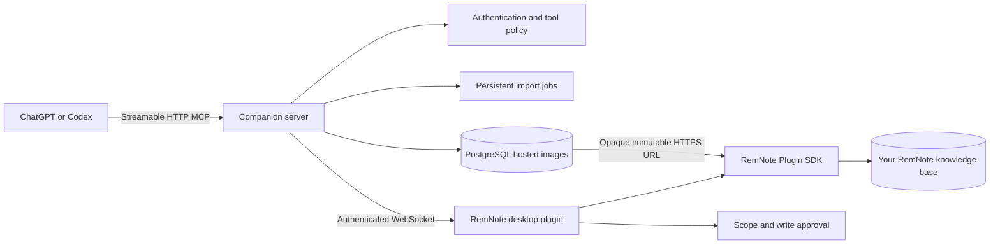

# RemNote MCP

RemNote MCP connects ChatGPT and Codex to RemNote through a secure Model
Context Protocol bridge. It can read focused notes, create structured content,
preserve formulas and cards, resume long imports, apply supported formatting,
insert native media from public URLs or ChatGPT image files, and verify its work
through RemNote readback.

RemNote is an ordered knowledge graph rather than a flat document store. The
bridge therefore preserves Rem hierarchy, Concepts, Descriptors, cards, rich
text, formulas, and stable IDs while preventing unsafe or duplicate writes.

## Features

- Bounded reads of the focused Rem, children, trees, cards, and rich text.
- Structured writes with previews, scope checks, stable idempotency keys, and
  post-write verification.
- Resumable Markdown imports with persistent checkpoints when PostgreSQL is
  configured.
- Durable hosting and native insertion for ChatGPT-created or attached images.
- Native image-URL, audio, YouTube, and direct-video insertion.
- Separate local and hosted authentication flows.
- Tool profiles that expose only the capabilities needed for a task.
- A RemNote sidebar for connection, scope, write access, and diagnostics.

## Architecture



The companion server routes requests but does not keep a copy of the knowledge
base. RemNote SDK operations run through the connected desktop plugin after
server policy and RemNote-side approval checks.

## Install the plugin

The current plugin version is **0.1.1**.

1. Download [PluginZip.zip](PluginZip.zip).
2. Open RemNote desktop and go to **Settings → Plugins**.
3. Choose **Upload plugin** and select the downloaded ZIP.
4. Enable **RemNote MCP** and open its sidebar panel.
5. Configure either the hosted connection or a local companion server.

RemNote desktop is required; the manifest intentionally disables mobile
execution. The root and server npm packages use the internal implementation
version `0.0.1`; the installable RemNote plugin uses version `0.1.1`.

## Connect to the hosted service

Set the plugin server URL to:

```text
wss://remnote-plugin-template-react.onrender.com/remnote
```

For ChatGPT Developer Mode, create a private MCP app using:

```text
https://remnote-plugin-template-react.onrender.com/mcp
```

Complete the displayed pairing flow in the RemNote plugin before using write
tools. Refresh the client connection after changing tool profiles.

Codex uses the same installed ChatGPT plugin connection and provider
authentication. No separate Codex secret or pairing route is required. Connect
and authorize the plugin in ChatGPT, then use it from either ChatGPT or Codex;
RemNote scope and write approvals still apply.

## Local development

Requirements: Node.js 20 or newer and RemNote desktop.

```bash
npm ci
npm ci --prefix server
cp .env.local.example .env
```

Replace all example secrets, keep `REMNOTE_BRIDGE_ALLOW_NO_TOKEN=0`, keep
deletion disabled, and start the companion server:

```bash
set -a
source .env
set +a
npm run server:dev
```

In another terminal, start the persistent plugin development server:

```bash
npm run dev:start
npm run dev:status
npm run dev:doctor
```

In RemNote choose **Develop from localhost** and enter exactly
`http://localhost:8080`. Do not append `/manifest.json`. Leave the service
running while RemNote uses the plugin, and stop it with `npm run dev:stop`.

## Tool profiles

Start with the smallest profile that supports the intended workflow.

| Profile | Tools | Use |
| --- | ---: | --- |
| `basic` | 8 | Connection status and bounded reads |
| `mass_note_writer` | 23 | Normal notes, resumable imports, images, and YouTube |
| `note_writer` | 55 | Additional note, audio, and media operations |
| `power_user` | 72 | Advanced formatting and repair |
| `developer` | 77 | Diagnostics and the complete media set |
| `danger` | 77 by default | Developer set while deletion remains disabled |

The delete tool is absent unless the server explicitly enables it. Never select
`danger` merely to access media tools.

## Common workflows

For a safe first read, ask the client to check bridge status, read the focused
Rem, and return at most 25 direct children without calling a write tool.

For writes:

1. Create or select a disposable parent Rem.
2. Approve only the smallest useful Rem tree.
3. Keep **Ask for every write** enabled.
4. Request a preview when available.
5. Supply one stable idempotency key.
6. Read the result back and verify structure and content.
7. Reuse the same key for a retry; do not invent a new key after an uncertain
   response.

Long Markdown imports should use the planning and resumable-job tools instead
of many unrelated small calls. Persistent resume across server restarts
requires PostgreSQL.

For a ChatGPT-created or attached image, use `insert_image_from_file` with one
stable idempotency key. The server consumes ChatGPT's temporary file reference,
validates PNG/JPEG/WebP/GIF bytes, stores them persistently in PostgreSQL, serves
an opaque immutable HTTPS asset, and inserts that URL through RemNote's native
image builder. Retries reuse the hosted asset without re-downloading the
temporary URL.

RemNote's current plugin SDK image builder accepts a URL; it does not expose a
binary upload API. A successful native readback therefore still depends on the
bridge URL. The tool reports `retained_remote_dependency` and keeps those bytes
so the image continues to render. It deletes only a newly created hosted orphan
after a definitive plugin no-write failure. Unknown write status and existing
assets are retained because deleting either could break a RemNote image.

Existing image, audio, YouTube, and direct-video URLs use the native URL tools.
A plain text link never counts as media insertion. Readback proves stored native
structure; a person must still confirm visible rendering or playback in RemNote.

## Security and permissions

- Choose the smallest scope and tool profile.
- Keep write confirmation on until the workflow is trusted.
- Keep deletion disabled for normal use.
- Never place bridge tokens, OAuth credentials, pairing codes,
  session secrets, or database URLs in prompts or committed files.
- Use TLS for remote connections and distinct high-entropy credentials for
  local bridge, OAuth, database, and administrative access.
- Treat remote note content and tool output as untrusted input.
- Shared OAuth authentication never replaces RemNote-side scope and write
  approval.

See [TOOL_REFERENCE.md](TOOL_REFERENCE.md) for tool schemas, permission tiers,
timeouts, idempotency behavior, and failure responses.

## Known limitations

- RemNote desktop must be open and the plugin connected for SDK reads or writes.
- The hosted ChatGPT connection uses a private Developer Mode app; this project
  is not a public ChatGPT App Store listing.
- Hosted image bytes remain in PostgreSQL until an operator removes them; there
  is no end-user media deletion or automatic expiry tool yet.
- Client tool metadata may be cached after changing profiles; refresh or
  recreate the client connection when tools are missing.
- Hosted image files require hosted OAuth, PostgreSQL, and a public HTTPS base
  URL. The opaque asset URL is public so RemNote can fetch it; do not host secret
  images through this path.
- Persistent import recovery requires PostgreSQL.
- Some RemNote SDK capabilities vary by installed desktop and SDK version.
  Unsupported operations return typed errors without mutating existing notes.

## Troubleshooting

- **Plugin missing in local development:** run `npm run dev:start`, then
  `npm run dev:status` and `npm run dev:doctor`. Install the exact base URL
  `http://localhost:8080`.
- **`ERR_CONNECTION_REFUSED` on port 8080:** restart the development server
  and leave it running.
- **`PLUGIN_NOT_CONNECTED`:** open RemNote, enable the plugin, verify the
  WebSocket URL and token, then inspect the Connection card and server health.
- **`PLUGIN_NOT_PAIRED`:** complete the active pairing flow and approve the
  required scope and write mode.
- **Media tools missing:** select `note_writer` or `developer`, then refresh
  the MCP client tool snapshot.
- **Uncertain write result:** keep the original idempotency key, inspect
  readback, and follow the returned reconciliation guidance.

## Development checks

```bash
npm test
npm run check-types
npm run validate
npm run build
npm run server:build
npm run server:smoke
```

Additional architecture, deployment, and verification detail is available in
[docs/engineering-guide.md](docs/engineering-guide.md) and
[docs/remnote-mcp-repair-and-testing.md](docs/remnote-mcp-repair-and-testing.md).
