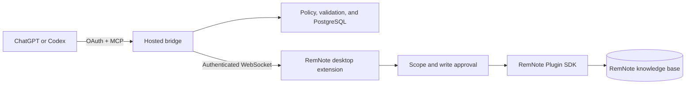

# RemNote MCP

RemNote MCP lets ChatGPT and Codex work with an existing RemNote knowledge
base through scoped, inspectable tools. It can read and search notes, create
structured Rem trees, preserve formulas and cards, run resumable imports, add
native media, and verify important writes through RemNote readback.

The project has two cooperating parts:

- a RemNote desktop extension loaded from this repository;
- an OAuth-protected MCP bridge hosted on Render.

The normal setup uses the local extension loader on port `8080` and the hosted
bridge. You do not need to run the bridge server or configure a local database
for this path.

## What it can do

- Read the focused Rem, children, trees, breadcrumbs, rich text, selections,
  and approved search results.
- Create and update native RemNote hierarchy without flattening it into one
  block of text.
- Preserve headings, formulas, highlights, Concepts, Descriptors, and common
  flashcard types.
- Plan and resume large Markdown imports with checkpoints, idempotency, and
  source-fidelity verification.
- Insert public image, audio, YouTube, and direct-video URLs as native media.
- Insert ChatGPT-uploaded PNG, JPEG, WebP, GIF, MP3, and genuine MP4 files
  through durable hosted media.
- Restrict access through scope, write-approval, and tool-profile controls.
- Return typed failures and readback evidence instead of pretending a partial
  operation succeeded.

The generated [tool reference](TOOL_REFERENCE.md) records the exact schemas,
permission tiers, timeouts, and idempotency behavior for the current registry.

## Architecture



The hosted bridge handles MCP discovery, authentication, policy, resumable
jobs, and hosted media. The desktop extension enforces the RemNote-side scope
and performs the SDK operation. The bridge does not copy the knowledge base
into PostgreSQL.

## Install the plugin from source

### Requirements

- RemNote desktop
- Node.js 20 or newer
- npm
- Git
- ChatGPT Developer Mode for the MCP connection

### 1. Start the RemNote development extension

```bash
git clone https://github.com/HTGit63/remnote-plugin-template-react.git
cd remnote-plugin-template-react
npm ci
npm run dev
```

Keep this terminal running. It serves the current source at:

```text
http://localhost:8080
```

In RemNote desktop:

1. Open **Settings → Plugins**.
2. Choose **Develop from localhost**.
3. Enter exactly `http://localhost:8080`.
4. Do not append `/manifest.json`.
5. Enable **RemNote MCP** and open its sidebar.

Port `8080` serves only the extension JavaScript and manifest. It is not an MCP
endpoint and does not require ngrok when you use the hosted Render bridge.

### 2. Connect the hosted bridge

New source installations default to:

```text
wss://remnote-plugin-template-react.onrender.com/remnote
```

If an older RemNote installation retained a localhost bridge override, replace
it in the RemNote MCP settings with the address above. User-entered custom
endpoints are otherwise preserved.

### 3. Connect ChatGPT or Codex

Create or refresh the private Developer Mode app with:

```text
https://remnote-plugin-template-react.onrender.com/mcp
```

Complete pairing in the RemNote sidebar, approve the smallest useful RemNote
scope, and keep **Ask for every write** enabled for the first run. ChatGPT and
Codex share the installed app authentication; there is no separate Codex
bearer token.

| Address | Consumer | Purpose |
| --- | --- | --- |
| `http://localhost:8080` | RemNote desktop | Load the extension source |
| `wss://remnote-plugin-template-react.onrender.com/remnote` | RemNote extension | Connect to the hosted bridge |
| `https://remnote-plugin-template-react.onrender.com/mcp` | ChatGPT or Codex | Connect to MCP |

After a deployment or tool-profile change, refresh the app under
**Settings → Plugins** and start a new conversation so the client receives the
current tool descriptors.

## Safe first test

Create and focus a disposable Rem named `Plugin Test`, then ask:

```text
Use RemNote MCP. Check bridge and plugin status, read the focused Rem, and
return at most 20 direct children in RemNote order. Do not call a write tool.
```

For a write test, approve only the disposable Rem, use one stable idempotency
key, request verification, and read the created Rem back. Reuse the same key
after an uncertain response instead of creating a second request identity.

## Uploaded image, audio, and video

The normal `mass_note_writer` profile includes:

- `insert_image_from_file` for PNG, JPEG, WebP, and GIF;
- `insert_audio_from_file` for MP3;
- `insert_video_from_file` for genuine MP4 containers.

Each action receives an authorized ChatGPT file, validates the actual bytes,
stores the asset in PostgreSQL, creates an opaque HTTPS URL, inserts native
RemNote media, and verifies the resulting rich text.

Current connected acceptance has passed for uploaded images, MP3 audio, and
MP4/H.264/AAC video. A file with an `.mp4` name but WebM bytes is rejected
correctly because validation does not trust the extension. SVG is intentionally
unsupported; convert trusted artwork to PNG before insertion.

Successful media bytes remain hosted because the RemNote object still points
to that HTTPS asset. Deleting them immediately would break playback or
rendering on another device. Only a newly created orphan from a definitive
no-write failure is removed automatically.

## Run the bridge locally with ngrok

This advanced path is only for developing the companion server. ChatGPT cannot
connect directly to `http://localhost:47392/mcp`, so a local MCP server needs a
public HTTPS tunnel.

1. Install the server dependencies:

```bash
npm ci --prefix server
cp .env.example .env
```

2. Replace every placeholder in `.env`, configure PostgreSQL, and generate
   independent session and admin secrets.
3. Load the environment and start the server:

```bash
set -a
source .env
set +a
npm run server:dev
```

4. In another terminal, run `ngrok http 47392`.
5. Set the RemNote bridge URL to `wss://YOUR-NGROK-HOST/remnote`.
6. Connect ChatGPT to `https://YOUR-NGROK-HOST/mcp`.

Keep authentication enabled. Never expose
`REMNOTE_BRIDGE_ALLOW_NO_TOKEN=1` through a tunnel. If the ngrok hostname
changes, update `.env`, the RemNote bridge setting, and the ChatGPT app.

## Tool profiles

| Profile | Public tools | Intended use |
| --- | ---: | --- |
| `basic` | 8 | Connection checks and bounded reads |
| `mass_note_writer` | 25 | Normal notes, imports, and uploaded media |
| `note_writer` | 57 | Wider note, card, design, and URL-media work |
| `power_user` | 74 | Advanced formatting and repair |
| `developer` | 79 | Diagnostics and the complete safe public surface |
| `danger` | 79 by default | Developer surface while deletion remains gated |

Deletion remains absent unless the server explicitly enables it. Media does
not require the danger profile.

## Security and permissions

- Use the smallest scope and tool profile that can complete the task.
- Keep write confirmation enabled until the workflow is trusted.
- Hosted file ingestion requires OAuth, an approved write scope, and
  PostgreSQL.
- Remote downloads require HTTPS and reject loopback, private, link-local,
  mapped, NAT64, and other unsafe address ranges.
- File signatures, byte limits, timeouts, safe names, redirects, and response
  content types are validated.
- Never commit OAuth secrets, database URLs, session secrets, bridge tokens,
  pairing codes, or private note content.
- Hosted asset URLs must be fetchable by RemNote. Do not use this media path
  for confidential files.

## Known boundaries

- RemNote desktop must remain open and connected for SDK reads and writes.
- This is currently a private Developer Mode integration, not a public ChatGPT
  listing.
- Native readback proves stored RemNote structure; a person must still confirm
  visible rendering and playback.
- Hosted media has per-file limits but no aggregate per-owner quota or
  end-user deletion screen yet.
- PostgreSQL is required for restart-safe imports and uploaded-file hosting.
- Some SDK capabilities vary with the installed RemNote desktop version;
  unsupported operations return typed errors without mutation.

## Troubleshooting

- **Extension does not load:** confirm `npm run dev` is still running and use
  exactly `http://localhost:8080`.
- **`PLUGIN_NOT_CONNECTED`:** open RemNote, enable RemNote MCP, and verify the
  hosted WebSocket setting.
- **`PLUGIN_NOT_PAIRED`:** complete pairing and approve the requested scope.
- **File tools are missing:** select `mass_note_writer` or `developer`, refresh
  the ChatGPT app, and start a new conversation.
- **`REMOTE_HOST_BLOCKED`:** the source resolved only to an unsafe address; do
  not weaken the network protection.
- **`HOSTED_MEDIA_UNSUPPORTED_FORMAT`:** the bytes do not match a supported
  format even if the filename extension looks correct.
- **Uncertain write:** retain the original idempotency key and follow the
  returned reconciliation guidance.

## Development checks

```bash
npm test
npm run check-types
npm run validate
npm run build
npm run server:build
npm run server:smoke
```

Additional architecture and testing details are available in
[docs/engineering-guide.md](docs/engineering-guide.md) and
[docs/remnote-mcp-repair-and-testing.md](docs/remnote-mcp-repair-and-testing.md).
